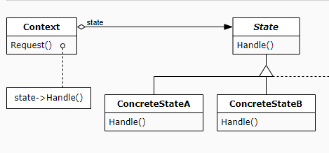

## State Pattern (상태 패턴)

객체의 내부 상태에 따라 스스로 행동을 변경할 수 있게 허가하는 패턴
상태 패턴은 4가지 요소가 있다.
1. context : 이는 클라이언트가 실제로 호출하는 객체가 된다. 컨텍스트 안에는 상태가 존재한다. 이 상태가 어떤 상태이던지 context에게 명령을 하면 갖고 있는 상태에 따라서 행동이 수행된다.
2. state: 상태들의 인터페이스
3. concrete state: 실제 상태가 이에 해당한다.
4. action: state 가 호출하는 실제 행동을 정의한다.

사람의 상태에 따라서 일하는 것을 예를 들어 이 요소들을 설명해보면,
1. context: 사람
2. state: 사람의 현재 상태
3. concrete state: 화난 상태, 행복한 상태, 졸린 상태, 배고픈 상태
4. action: 일

context가 갖고 있는 state는 concrete state 에 의해서 계속 변경된다. context 는 계속 일을 수행하지만, concrete state에 따라서 일을 열심히 한다던지, 엉망진창으로 한다던지 변경되게 된다.



## 예

폰노이만 구조에 따르면, CPU는 Decode, Fetch, Execution 를 매 클럭마다 반복합니다. 이를 상태 패턴으로 바꾸면 

1. context: cpu
2. state: 현재 어떤 일을 할지에 대한 인터페이스
3. concrete state: fetch, decode, execution
4. action: 각 단계별로 해야할 일을 수행.

```java
abstract class State {
    void process() = 0;
}

class FetchState extends State  {
    void process() {
        print("레지스터에서 메모리를 갖고 옵니다.");
    }
}

class DecodeState extends State  {
    void process() {
        print("명령어를 해석합니다.");
    }
}

class ExecutionState extends State  {
    void process() {
        print("명령어를 실행합니다.");
    }
}

class CPUContext {
    State cpuState;
    void changeState(State state) {
        cpuState = state;
    }

    void process() {
        cpuState.process();
    }
}

void main(String[] args) {
    CPUContext cpu;
    List<State> states { new FetchState(), new DecodeState(), new ExecutionState() };
    int index = 0;
    while(true)
    {
        sleep(1);
        cpu.changeState(states[index]);
        cpu.process();
        index = (index + 1) % states.size();
    }
}
```

예제 코드를 보면 1초마다 fetch, decode, execution 상태를 바꾸면서 반복해서 수행하고 있다. cpu의 상태를 좀 더 확장 시켜서 가상 메모리의 주소를 물리 메모리로 바꾸는 상태를 추가한다면, state 를 상속받아서 처리만 하면 되기 때문에, 상태의 확장이 편리하고 유지보수성이 올라간다. 또한 클라이언트는 CPU 내부의 상태가 어떤 상태던지 cpu.process() 함수만 호출하면 되기 때문에 코드가 분리가 된다.

## 결론

상태 패턴을 활용하면 다음과 같은 장점이 있다.
1. 유지보수성: 상태 패턴은 개방 폐쇄 원칙을 따른다. 상태와 이에 따른 행동을 정의할 때 쉽게 확장할 수 있고, 다른 코드를 수정하지 않아도 된다.
2. 보안성: 상태를 몰라도 외부에서는 정해진 행동만 호출해주면 된다.
3. 유연성: 동적으로 상태들을 바꿔주면 다른 행동을 수행할 수 있다.

상태 패턴은 상태를 가진 곳에서 활용이 많이 된다. 가령 AI 시스템을 만들 때 AI 의 현재 상태에 따라서 매 프레임마다 행동을 정의할 수 있고, 로그인 처리를 할 때 로그인 상태( Connection 시도, 로그인 중, 로그인 완료 ) 에 따른 행동을 정의할 때도 사용된다.